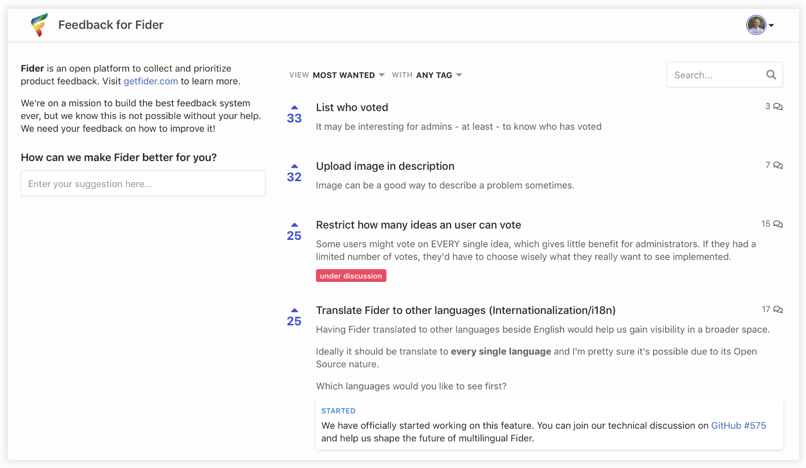

# Fider &middot;  

Fider is an open platform to collect and organize customer feedback. By using the platform, your community can share, vote and discuss on ideas they have to make your product or company even better. 

[See it in action](https://feedback.fider.io/) or visit http://getfider.com for information about it and how to host your own instance.

# How Fider is organized

[Feedback for Fider](https://feedback.fider.io/) is the entry point for any new feature request. We use our own platform for users to share and vote on what they would like to see implemented on Fider.

[GitHub Issues](https://github.com/getfider/fider/issues) is created for every **accepted feature request**, **technical improvement** or **bugs** that is necessary. Every issue should briefly describes what's the work involved. Issues are used to track progress on its development.

We have a new [GitHub Milestone](https://github.com/getfider/fider/milestones) every month that lists everything that is due to be released on that month.

- **Found a bug?** Create an issue on [GitHub](https://github.com/getfider/fider/issues).
- **Want to request a feature?** Share it on [Feedback for Fider](https://feedback.fider.io/).
- **Got a question?** Send a tweet to [@getfider](twitter.com/getfider) or email admin@fider.io.
- **Want to contribute?** Read how to configure a development environment at [CONTRIBUTING.md](CONTRIBUTING.md).
